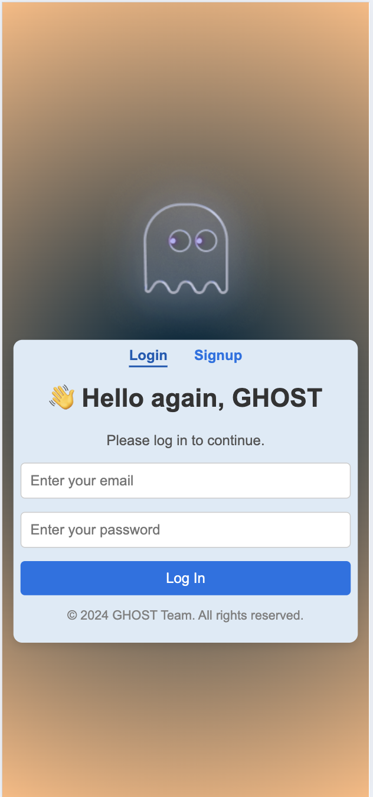
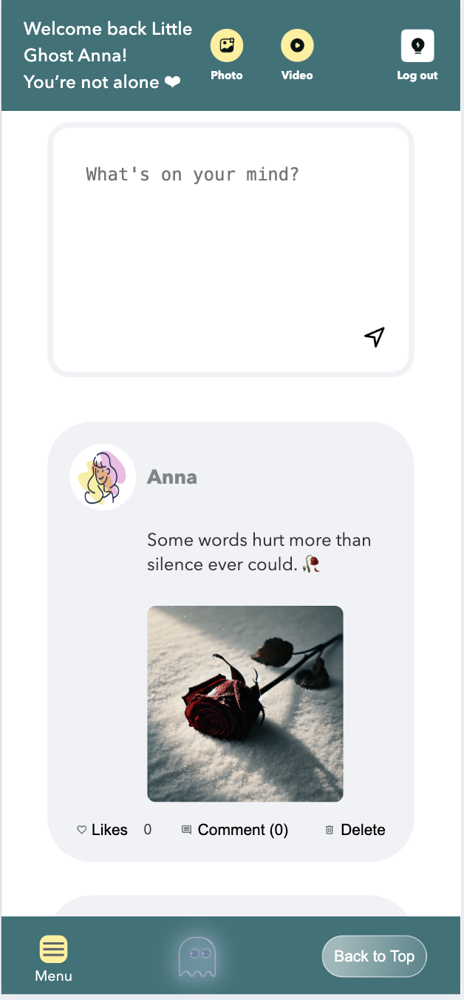

# Ghost - Social Sharing Platform
### 1.How to run the code: 

- After downloading the code from GitHub, first run "npm i", then run "npm start". This will take you to the registration/login page.  
- You can use our test account: Username: 123@123.com, Password: 123.   
- You are also welcomed to create your own username and password to register and log in.

### 2.Introduction:

Ghost - Social Sharing Platform

- Ghost is a social network for young adults dealing with anxiety, depression, or other mental health struggles. It’s a safe, anonymous space where users can share their thoughts, connect with others who understand, and feel supported. The platform includes features like posting, group selecting, and personalized profiles based on mental health experiences. Ghost aims to help users feel heard, build connections, and better understand their mental health in a simple, supportive way.   
- Currently, users can create posts, comment on posts, change post group and update their profile. 

- The backend database of the project is developed using Parse and hosted on Back4App.

- The web app is also responsive to both desktop and mobile screens,

### 3.Video and screenshots

- Video

    

---

- Web UI

    
    
    
    
    
    
 

---

- Mobile UI

    
    
    
    
    
    

