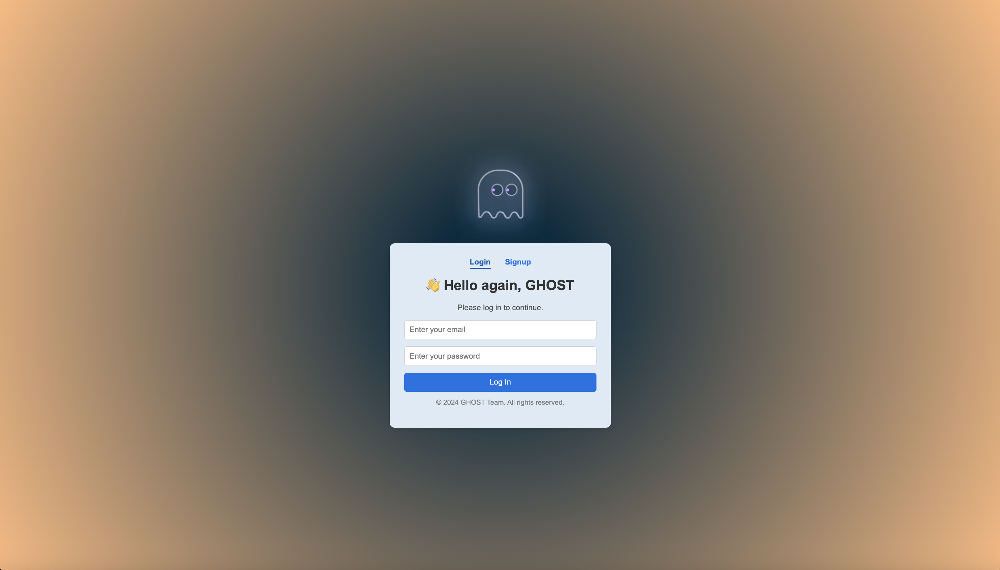
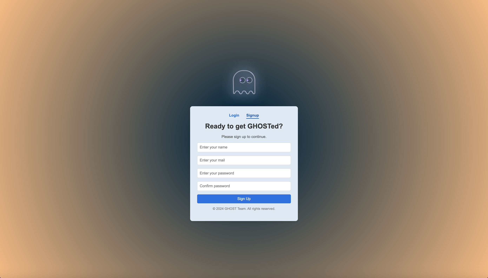
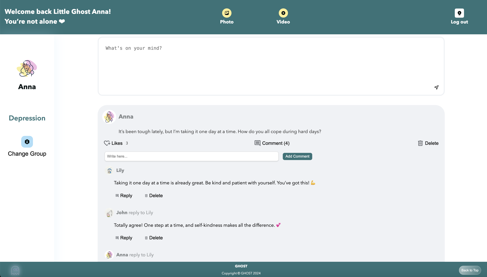
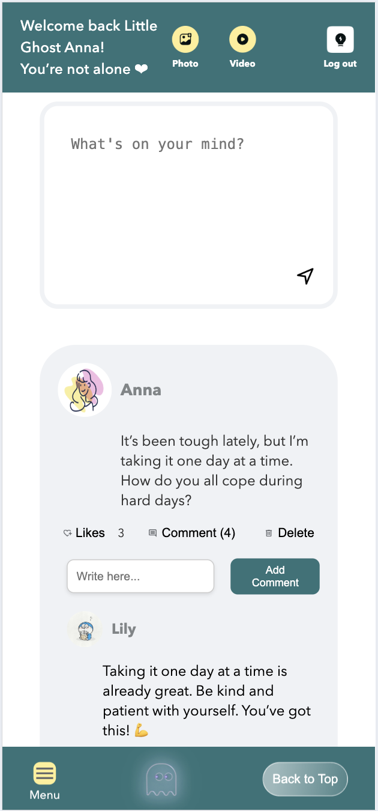
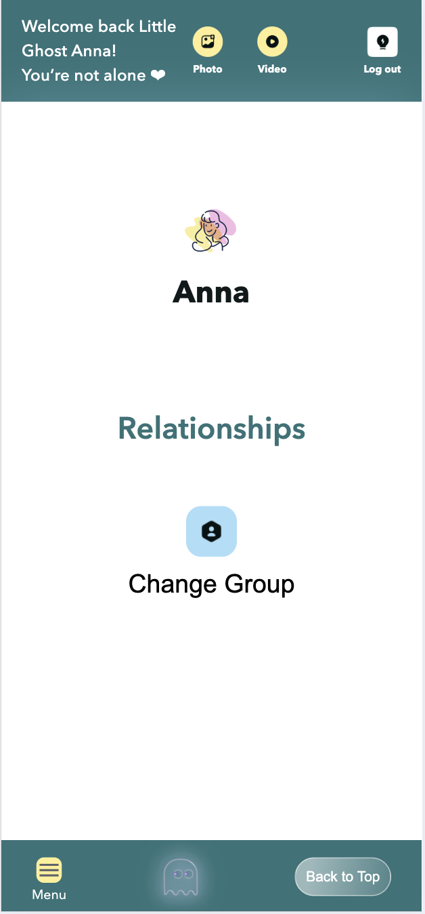

# Ghost - Social Sharing Platform

Anonymous social app designed to give young adults a safe space to share feelings, vent, and connect around mental-health-related topics without exposing real identities. Built on Next.js App Router with Prisma + PostgreSQL, Firebase auth, and Vercel Blob for media storage.

Live: https://social-chat-dk.vercel.app/

## Features

- Email/password signup and login (Firebase Auth); user profile is created or updated on first sign-in.
- Group-based feed (e.g., “just want to talk”); post text, images, or video; per-group aliases for anonymity.
- Likes, nested comments/replies, and author-only delete for posts/comments.
- Profile page to edit display name, gender, language, country, and upload avatar (stored in Vercel Blob).
- Responsive UI for desktop and mobile.

## Tech Stack

| Layer        | Tech                                                            | Notes                                                 |
| ------------ | --------------------------------------------------------------- | ----------------------------------------------------- |
| Framework    | Next.js 14 (App Router), React 18                               | Hybrid server/client rendering                        |
| UI           | Styled Components                                               | Styling and animations                                |
| State & Data | React Query, Zustand                                            | TanStack Query (server state), Zustand (client state) |
| Backend      | Prisma ORM + PostgreSQL                                         | Database hosted on Neon                               |
| Auth         | Firebase Auth + Firebase Admin                                  |                                                       |
| Storage      | Vercel Blob                                                     |                                                       |
| Deployment   | Vercel (app), Neon (DB), Firebase (auth), Vercel Blob (storage) | Hosting/infra                                         |
| CI/CD        | GitHub Actions                                                  | Build/deploy automation                               |

## Data Flow


(Source: `images/data-flow.mmd`)

Notes:

- Auth: Firebase issues ID token → stored in `localStorage` (`authToken`) → attached by `src/client/httpClient.ts`.
- API: `app/api/*` handlers validate token with Firebase Admin, then read/write Postgres via Prisma.
- State: React Query caches posts/comments/likes and updates after mutations.
- Media: `/api/upload` streams files to Vercel Blob, returns URL for posts/profile avatars.
- Groups/alias: `useUserStore` persists selected group and per-group alias in `localStorage`; groups fetched from `/api/groups`.

## Database Model


The schema uses Postgres with Prisma models

## Project Structure

```
.
├─ prisma/                     # Prisma schema, migrations, seed data

├─ public/                     # Static assets (Next public/)
├─ src/
│  ├─ app/                     # Next.js App Router
│  │  ├─ api/                  # API routes
│  │  │  ├─ auth/              # /api/auth/me
│  │  │  ├─ groups/            # /api/groups
│  │  │  ├─ posts/             # /api/posts + nested comments/likes CRUD
│  │  │  ├─ upload/            # /api/upload (Vercel Blob)
│  │  │  └─ users/             # /api/users/me profile update
│  │  ├─ login/ signup/        # Auth pages
│  │  ├─ profile/              # Profile page
│  │  ├─ layout.tsx            # Root layout & metadata
│  │  ├─ page.tsx              # Home entry
│  │  └─ providers.tsx         # Global providers (React Query, theme, auth listener)

│  ├─ client/                  # Client-side API wrappers
│  │  ├─ authApi.ts            # Auth-related requests
│  │  ├─ commentsApi.ts        # Comments CRUD
│  │  ├─ groupsApi.ts          # Groups fetch
│  │  ├─ httpClient.ts         # Fetch wrapper with auth token
│  │  └─ postsApi.ts           # Posts/likes fetch & mutations

│  ├─ features/                # Feature modules
│  │  ├─ auth/                 # Login/signup UI
│  │  ├─ home/                 # Feed, posting, left bar, top bar, comments, likes
│  │  └─ profile/              # Profile header/content/footer UI

│  ├─ hooks/                   # React Query hooks (posts, upload)
│  ├─ lib/                     # Shared libraries
│  │  ├─ client/               # Firebase client init, alert override
│  │  └─ server/               # Prisma client, Firebase Admin, blob helpers, API utils
│  ├─ store/                   # Zustand store (user/group state)
│  ├─ styles/                  # Global styles, theme, responsive helpers
│  └─ types/                   # Shared schemas (zod), models, asset typings

```

## Getting Started

1. Install deps: `npm install` (runs `prisma generate`).
2. Run migrations: `npm run db:migrate` (or `npx prisma migrate dev`).
3. Seed default groups (optional; APIs also upsert): `npm run db:seed`.
4. Start dev server: `npm run dev` and open http://localhost:3000.
5. Production build: `npm run build` then `npm start`.

## Usage Notes

- First login creates/syncs the user in the database; guests can browse default groups.
- Select a group before posting;
- Profile page lets you update name/gender/language/country and avatar.

## Demo

### Web

- Demo GIF: 

- Web UI:

  
  
  
  
  
  
  
  

### Mobile

- Demo GIF: 

- Mobile UI:

  
  
  
  
  
